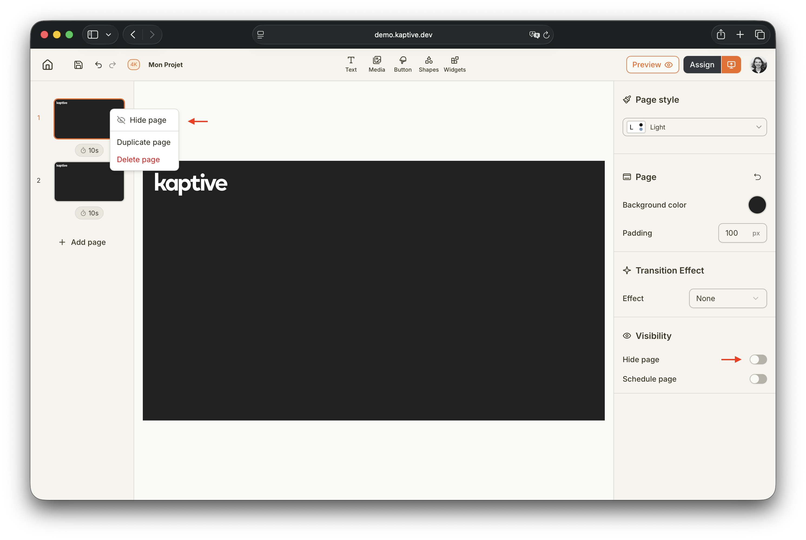
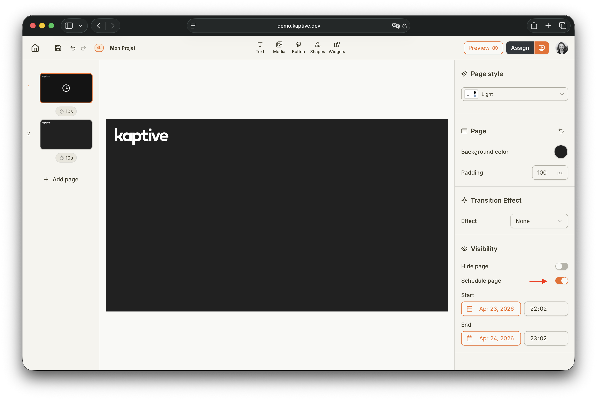

import { Aside } from '@astrojs/starlight/components';

Parfois, vous souhaiterez peut-être masquer une page d'un projet ou la planifier pour qu'elle ne soit affichée que pendant une période spécifique. Ce guide explique comment procéder dans Kaptive.

## Masquer une page de projet

Lorsqu'une page spécifique est masquée, elle n'est pas affichée sur un Player. Elle est alors ignorée dans la boucle de lecture et la transition de la page précédente mène directement à la prochaine page non masquée.

<Aside type="note">Si vous avez un bouton qui redirige vers une page masquée, le bouton redirigera à la place vers la page suivante non masquée.</Aside>

Pour masquer une page de projet, cliquez avec le bouton droit sur la page dans le panneau de gauche de l'éditeur et sélectionnez `Masquer la page`, ou sélectionnez la page et activez l'interrupteur `Masquer la page` dans le panneau des propriétés de la page.

## Planifier une page de projet

Lorsqu'une page spécifique est planifiée, elle n'est affichée sur un Player que pendant la période planifiée. En dehors de cette période, la page est masquée et ignorée dans la boucle de lecture.

Pour planifier une page de projet, activez l'interrupteur `Planifier la page` dans le panneau des propriétés de la page. Définissez ensuite la date et l'heure de début et de fin pendant lesquelles la page doit être affichée. Une fois publiée, la page ne sera visible sur le Player que pendant la période planifiée.

