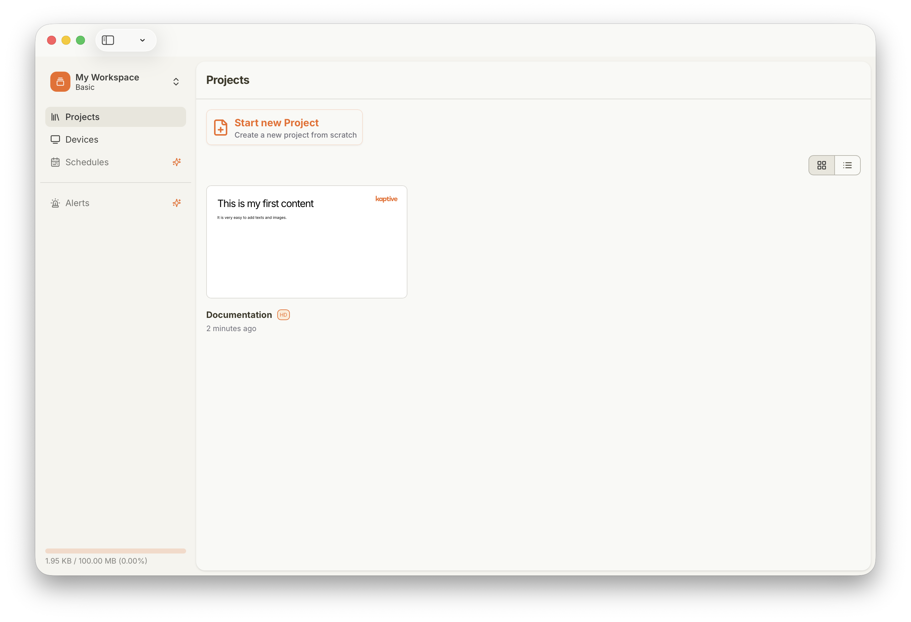
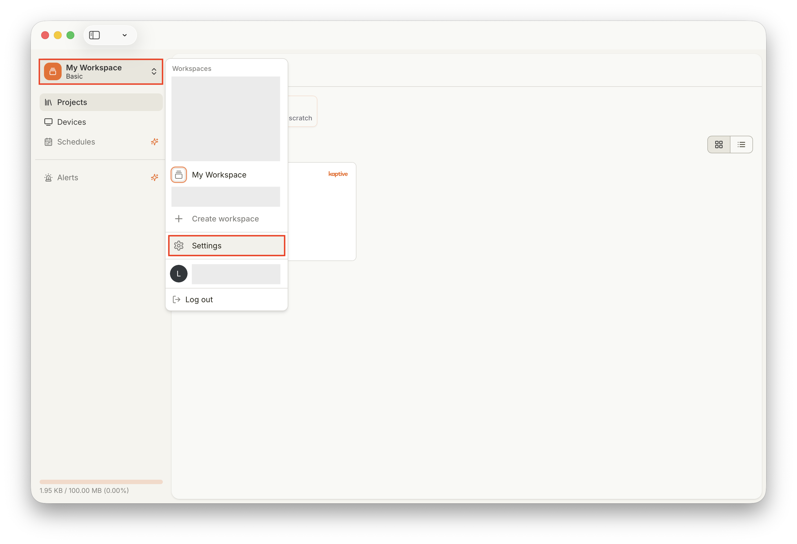
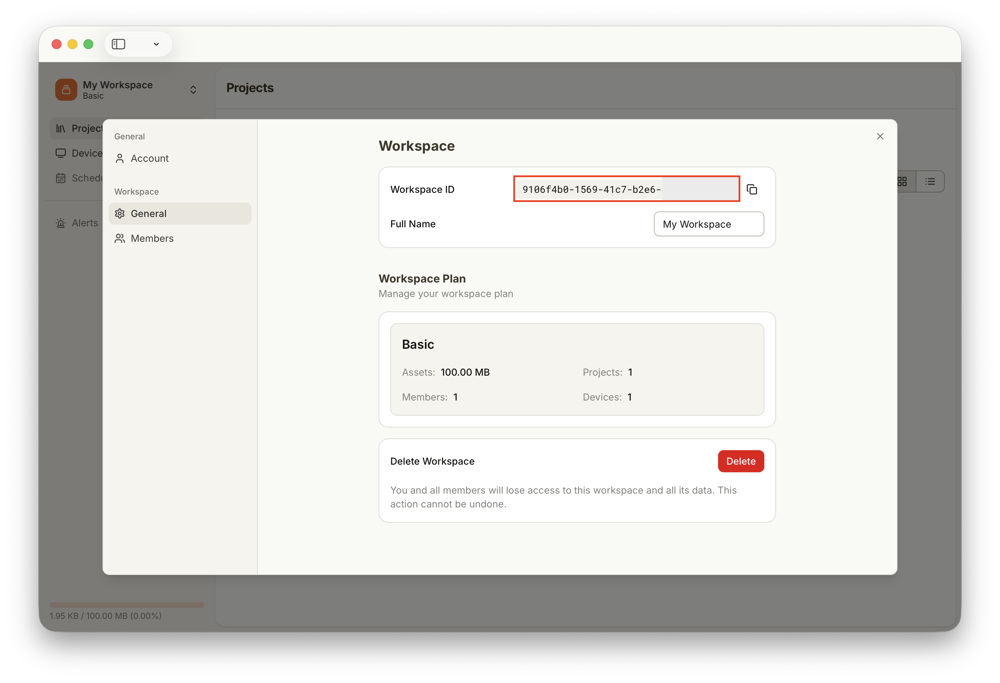

import { Steps } from '@astrojs/starlight/components';

Ce guide explique comment trouver l'identifiant unique (ID) de votre Workspace dans Kaptive.

## Trouver l'identifiant de votre Workspace

<Steps>

1. **Ouvrir le Workspace**

    Connectez-vous à Kaptive Manager et accédez à la page Projects de votre Workspace.

    

2. **Accéder aux paramètres**

    Cliquez sur le nom du Workspace en haut à gauche pour ouvrir le menu déroulant, puis sélectionnez `Settings`.

    

3. **Copier l'identifiant**

    Dans les paramètres, sous General, vous trouverez le Workspace ID. Cliquez sur l'icône de copie à côté de l'identifiant pour le copier dans le presse-papiers et envoyez-le nous par email à [info@kaptive.ch](mailto:info@kaptive.ch).

    

</Steps>
