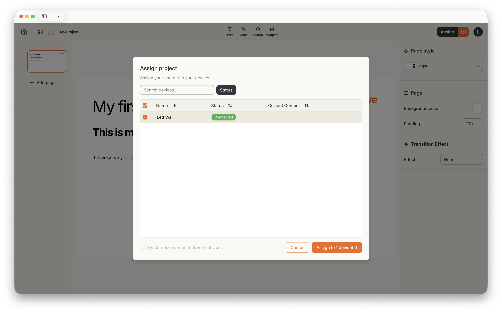

## How Assigning your Project to a Kaptive Player Works

As soon as you have created your Project, you will want to assign it to your Kaptive Players. This step is called assigning.

When clicking the `Assign` button on the top right in the Kaptive Editor, you will be able to select which Players you want to assign your Project to. Once you have selected the Players, click `Assign` to start the projection on the Kaptive Players.

The assigned Project will start playing on the selected Kaptive Players immediately. You can assign the same Project to multiple Players. The assigned Project will be the default content that plays on the assigned Players.

Read in the next chapter how scheduling of Projects works on Kaptive.

## Publish Updates of your Project

Sometimes you will want to update your Project after you have assigned it to your Players. For example, you might want to change some content or fix a typo. In this case, you can simply click the orange `Publish` button right next to the `Assign` button in the Kaptive Editor. This will publish the latest version of your Project to all the Players that are currently assigned to it.

This is especially important when you have scheduled your Project in a Schedule. For the Schedule to show the latest version of your Project, you need to publish the changes after editing your Project. Read more about scheduling in the next chapter.