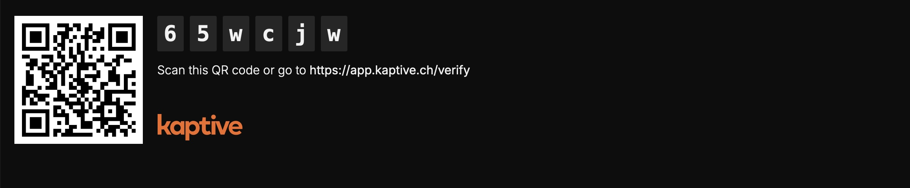

import { Steps } from '@astrojs/starlight/components';

# Choose Your Player Type

You can play Kaptive content using either a dedicated Kaptive player device or a web player that can run in any browser. The dedicated player offers enhanced reliability and security out of the box. Some features, like player screenshots are not available in the web players.

We recommand using a dedicated Kaptive player for commercial deployments, while web players are suitable for testing and small-scale use cases.

The web player can be accessed at [https://player.kaptive.ch](https://player.kaptive.ch).

# Connect a player to your account

When first booting up a Kaptive player or when accessing the web player, you will be prompted to connect the player to your Kaptive account.

To connect the player to your account:

<Steps>
    1. Scan the QR code or enter the code manually at [https://app.kaptive.ch/verify](https://app.kaptive.ch/verify).
    2. Choose a name for your player to identify it in your account.
    3. Select the workspace where you want to add the player.
    4. Click `Verify Device`.
 </Steps>

Once the player is connected, it will appear in your account under the selected workspace, and you can start publishing content to it.