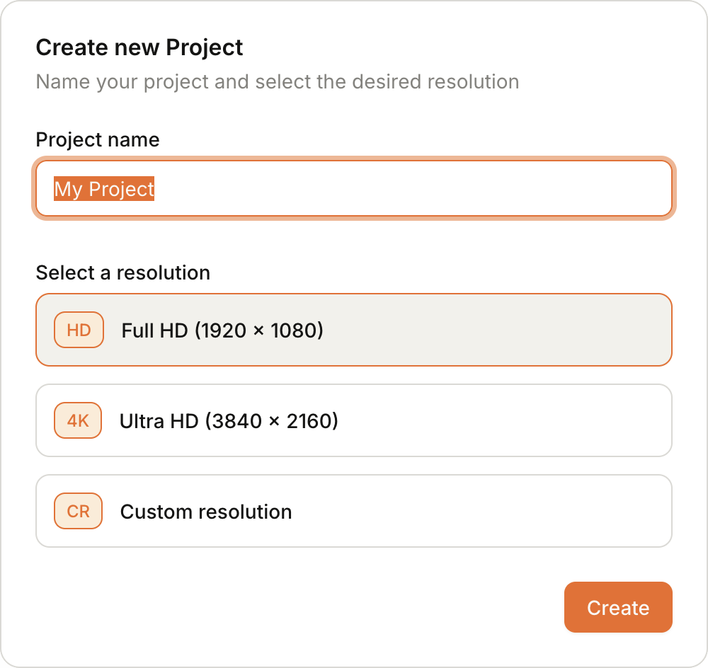
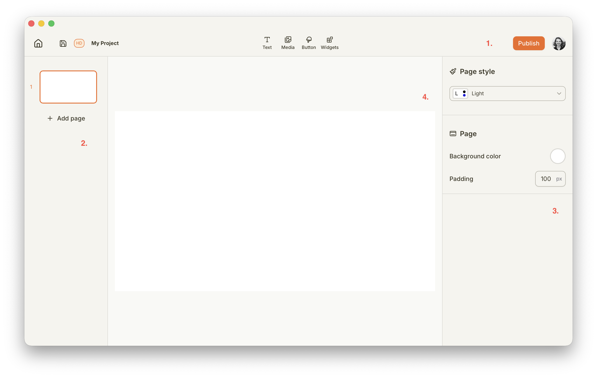
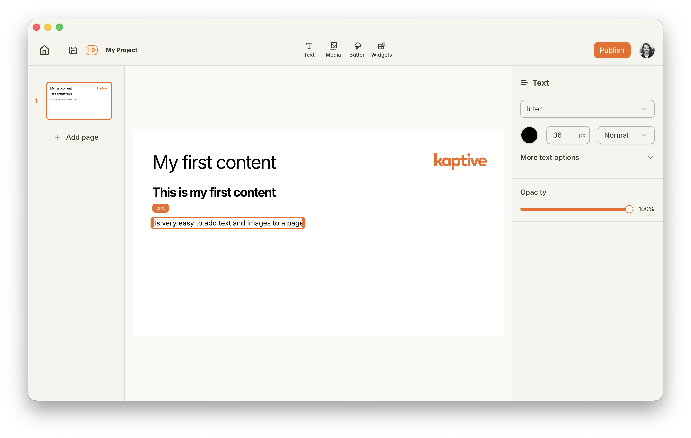

import { Steps } from '@astrojs/starlight/components';

# What is a Project?

A project in Kaptive is a container for your digital signage content. It allows you to create layouts, add media and content elements, and organize everything in one place. A project can have multiple pages, each page will fill the entire screen when published. You can choose to transition between pages either automatically after a set duration or manually using interactive elements.

# Creating a New Project

You can create a new project from the Projects section of your Kaptive dashboard. Follow these steps to create a new project:

<Steps>
    1. In the Project section click on the `Start new Project` button.
    2. Enter a name and resolution for your project.

       

       The resolution should match the resolution of the screen where the content will be displayed.
    3. Click `Create` to finalize the creation of your project.
</Steps>

# Using the Project Editor

The Kaptive project editor is an intuitive drag-and-drop interface that allows you to design your digital signage content easily. You can add various content elements such as images, videos, text, and interactive widgets to your project pages.

The project editor is divided into 4 sections:

    1. The toolbar at the top provides access to project settings, publishing controls and tools for adding content elements.
    2. The left sidebar contains the list of pages in your project and allows you to navigate between them.
    3. The right sidebar displays the properties and settings for the selected content element, allowing you to customize its appearance and behavior.
    4. The central canvas area is where you design your project pages by adding and arranging content elements.

## Create your first content

To get started, try adding a few content elements to your project page. You can drag and drop images, videos, and text from the toolbar onto the canvas. Experiment with different layouts and styles to see what works best for your digital signage needs.

