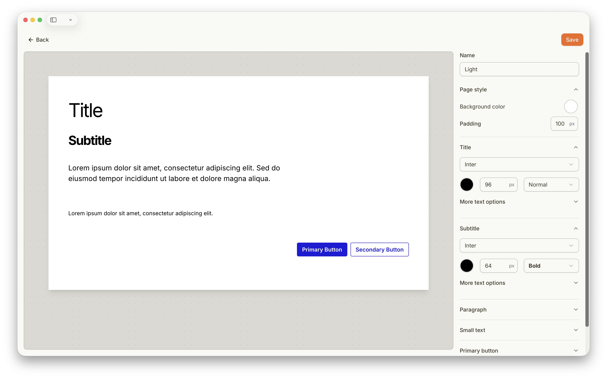

## About Page Styles

Each Page has a Page Style that defines its default appearance, including background color, fonts, and other style settings. You can customize the Page Style to match your branding or design preferences. You can also create different Page Styles for each Page of your Project.

After adapting a Page Style, save it to apply it on your Project.