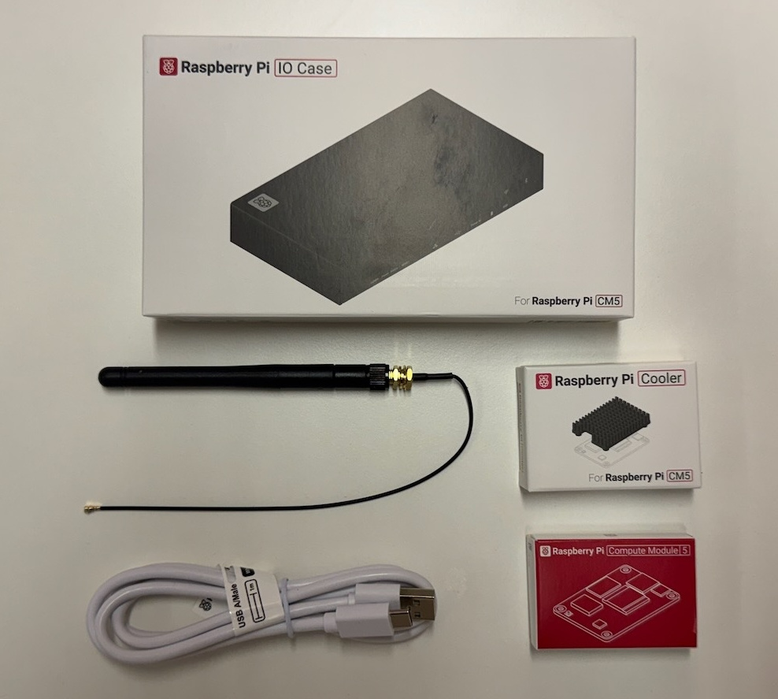
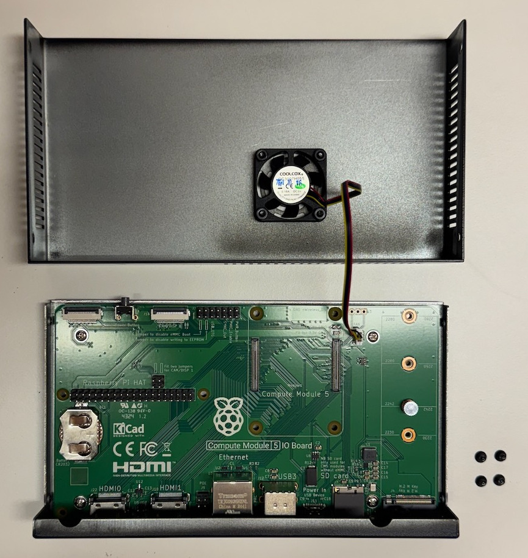
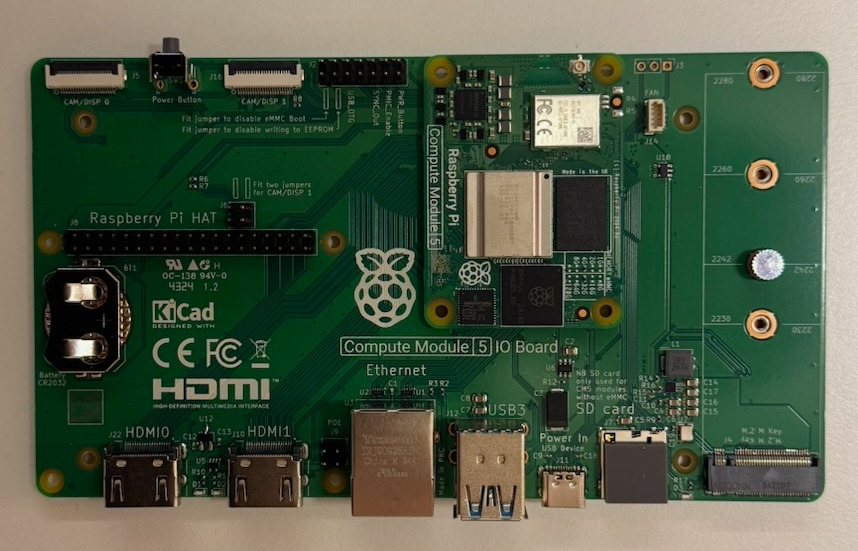
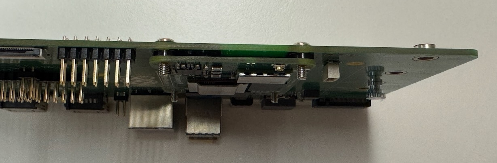
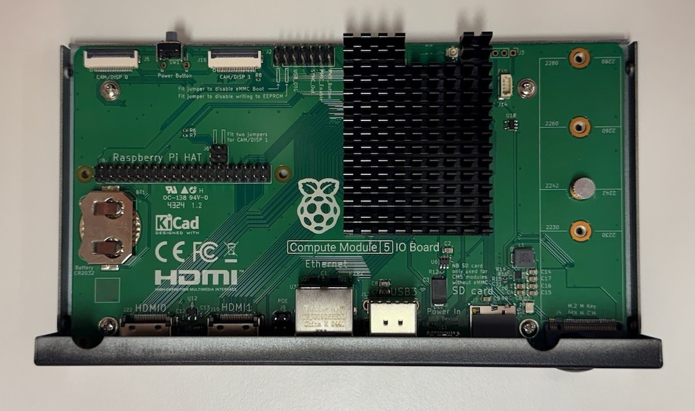
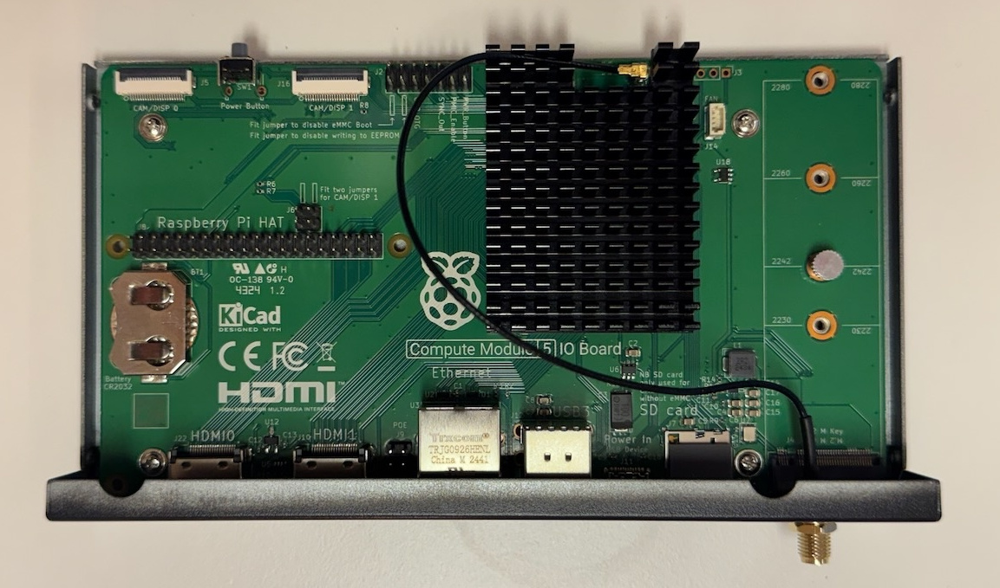
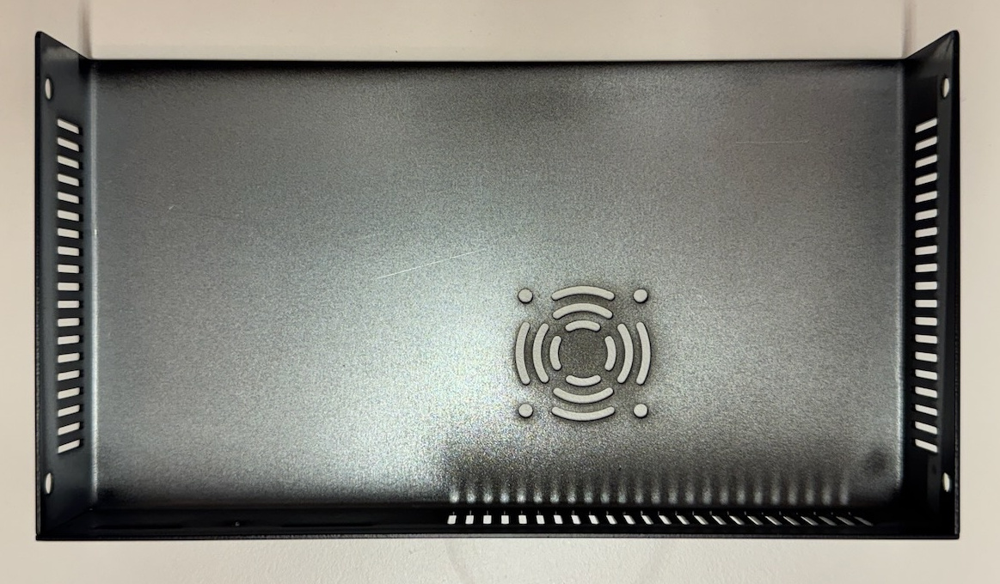
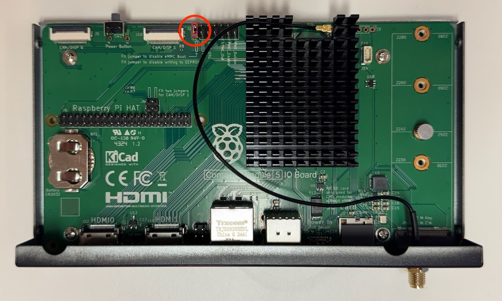
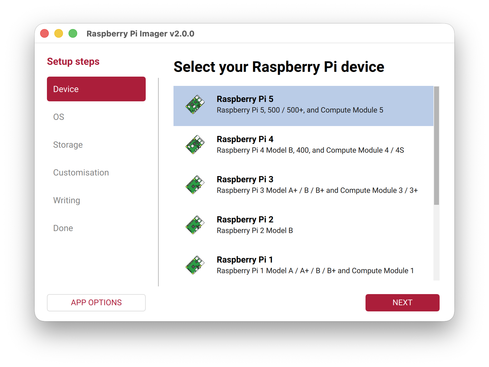
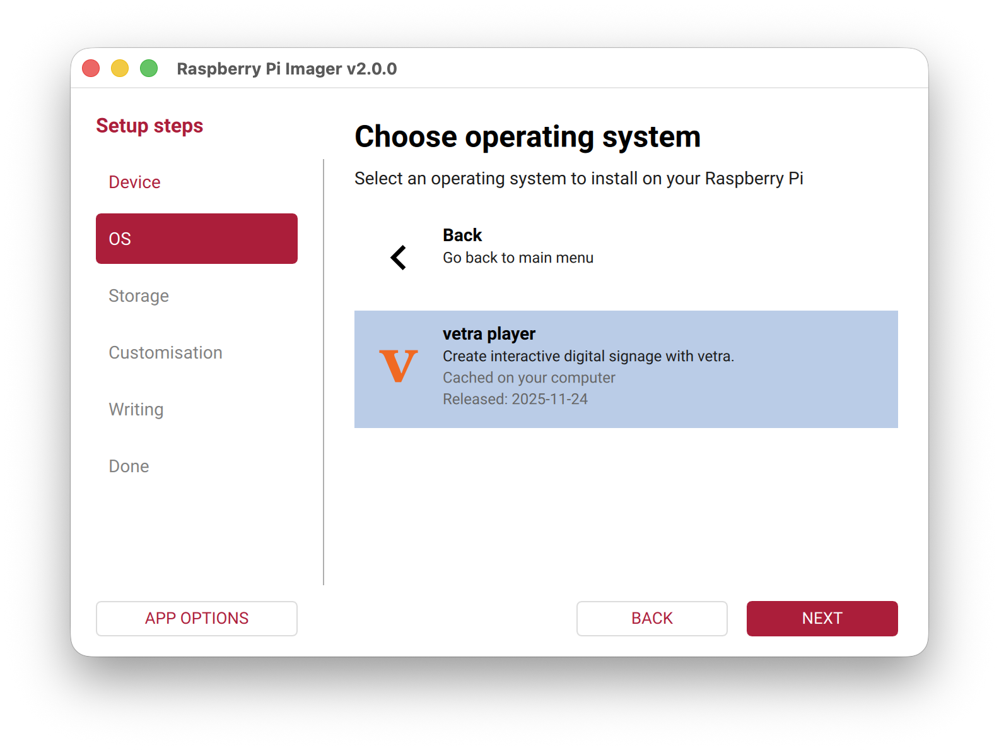

import { Steps } from '@astrojs/starlight/components';
import { Aside } from '@astrojs/starlight/components';
import { Tabs, TabItem } from '@astrojs/starlight/components';


# Material

To assemble your own Kaptive player we recommend using a compute module 5 developer kit from Raspberry Pi. The kit includes everything you need to get started:



## Install the compute module on the IO board

<Steps>
    1. Unscrew the 2 screws on each side of the case to open it.
       
       <Aside> Be careful when opening the case, the fan is connected to the IO board with a cable. </Aside>

       

    2. Unscrew the IO Board from the case using the 4 screws at the corner of the printed circuit board.

    3. Insert the compute module into the IO board's socket, ensuring it is properly aligned. It should click into place.
       
       
    
</Steps>

## Install the Raspberry Pi Cooler

<Steps>
    1. Take the 4 small plastic spacers and insert them between the compute module and the IO Board, aligning them with the screw holes.

       

    2. Place the screws through the IO board and spacers into the compute module
       
       

    3. Place the cooler on top of the compute module and tighten the screws to secure it in place.

       
</Steps>

## (Optional) Install the WiFi antenna

If you wish to use WiFi connectivity, you can install the included antenna. Simple click the antenna onto the designated connector on the IO board and screw it in place on the back of the case.



## Remove the active cooling fan

There is a design flaw in the Raspberry Pi Compute Module 5 case which prevents using both the active cooling fan and the passive cooler at the same time. To ensure reliable cooling performance, we recommend removing the active cooling fan entirely and using only the passive cooler.

To remove the fan, simply unplug the fan's power cable from the IO board and unscrew the fan from the case.



## Flash the operating system

<Steps>

    1. To flash the operating system onto your compute module you first need to add a jumper to the `eMMC_BOOT_DISABLE` header on the IO board. This will allow the compute module to boot from USB.

       

    2. Prepare the host device
       <Tabs>
            <TabItem label="MacOS">


                To set up software on a macOS host device:

                    1. First, [build rpiboot from source](https://github.com/raspberrypi/usbboot?tab=readme-ov-file#macos).

                    2. Connect the IO Board to the Mac.

                    3. Then, run the rpiboot executable with the following command:

                       ```rpiboot -d mass-storage-gadget64```

                    4. When the command finishes running, you should see a message stating "The disk you inserted was not readable by this computer." Click Ignore. Your Compute Module should now appear as a mass storage device.

            </TabItem>
            <TabItem label="Windows">


                To set up software on a Windows 11 host device:

                    1. Download the [Windows installer](https://github.com/raspberrypi/usbboot/raw/master/win32/rpiboot_setup.exe) or [build rpiboot from source](https://github.com/raspberrypi/usbboot).

                    2. Double-click on the installer to run it. This installs the drivers and boot tool. Do not close any driver installation windows which appear during the installation process.

                    3. Reboot

                    4. Connect the IO Board to the PC. Windows should discover the hardware and configure the required drivers.

                    5. Select Raspberry Pi - Mass Storage Gadget - 64-bit from the start menu. After a few seconds, the Compute Module eMMC or NVMe will appear as USB mass storage devices. This also provides a debug console as a serial port gadget.


            </TabItem>
            <TabItem label="Linux">
            
                To set up software on a Linux host device:

                    1. Run the following command to install rpiboot (or, alternatively, build rpiboot from source):

                       ```sudo apt install rpiboot```

                    2. Connect the IO Board to the PC.

                    3. Then, run rpiboot:

                       ```sudo rpiboot```

                    4. After a few seconds, the Compute Module should appear as a mass storage device. Check the /dev/ directory, likely /dev/sda or /dev/sdb, for the device. Alternatively, run lsblk and search for a device with a storage capacity that matches the capacity of your Compute Module.

            </TabItem>
       </Tabs>

       [Source: Raspberry Pi Documentation](https://www.raspberrypi.com/documentation/computers/compute-module.html#set-up-the-host-device)
    
    3. Flash the Kaptive OS image onto the compute module using [Raspberry Pi Imager](https://www.raspberrypi.com/software/).

        1. Select the device: Raspberry Pi 5
           
        2. Select the OS: You can find the Kaptive player image under `Freemium and paid-for OS` > `Digital Signage OS` > `Kaptive player`
           
        3. Select the compute module as the storage device
        4. (Optional) Customize the OS settings
           <Aside type="danger">The username cannot be changed and should always be `kaptive`.</Aside>
        5. Click `Write` to flash the OS onto the compute module.

    4. Once the flashing process is complete, remove the jumper from the `eMMC_BOOT_DISABLE` header.
       <Aside> Leaving the jumper on will prevent the compute module from booting to the Kaptive OS</Aside>
</Steps>

## Final assembly and first boot

Once the OS is flashed, you can reassemble the case by screwing the IO board back into the case and screwing the case back together.

Connect the power supply to the player and power it on. The player should boot into the Kaptive OS and be ready for use.

<Aside> On first boot, the player may take a few minutes to complete initial setup tasks. Please be patient during this process. </Aside>

