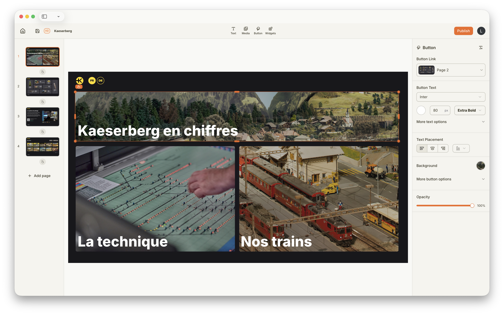
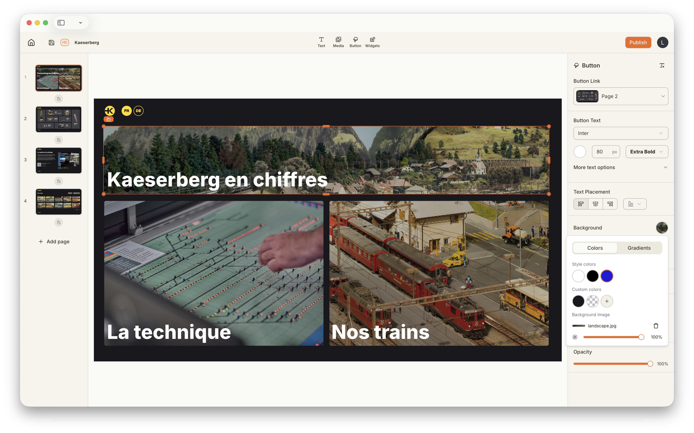

import { Image } from 'astro:assets';
import backButton from '../../../../assets/getting-started/interactivity/back.png';

## Cos'è l'Interattività?

Il Kaptive Editor permette di creare interfacce completamente touch-native, progettate per l'interazione fisica con gli schermi. Puoi aggiungere pulsanti, modelli 3D, PDF scorrevoli e molti altri elementi e widget che consentono di creare un'intera applicazione per musei, orientamento negli edifici, schermi informativi o schermi per ordinazioni.

Invece di dover implementare un'intera applicazione web o nativa per gestire un touchscreen, puoi fare tutto con Kaptive.

## Aggiungi Pulsanti

Nella barra degli strumenti del Kaptive Editor, puoi scegliere di aggiungere un pulsante al tuo Progetto. Nelle proprietà di un pulsante, puoi scegliere a quale Pagina collegarlo. Questo ti permette di creare intere applicazioni con più Pagine, transizioni e interazioni.

Non dimenticare di aggiungere pulsanti "indietro" nelle Pagine di dettaglio, per poter navigare correttamente attraverso l'intera applicazione.

## Aggiungi Trasparenza o Immagini agli Sfondi dei Pulsanti

Per creare applicazioni interattive più avanzate, puoi rendere i pulsanti trasparenti o aggiungere immagini di sfondo. Questo ti permette di creare facilmente bento box, liste o creare schemi, planimetrie o mappe cliccabili.

