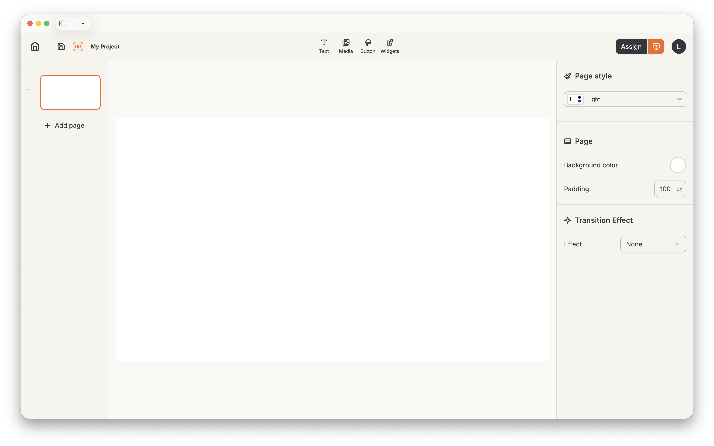
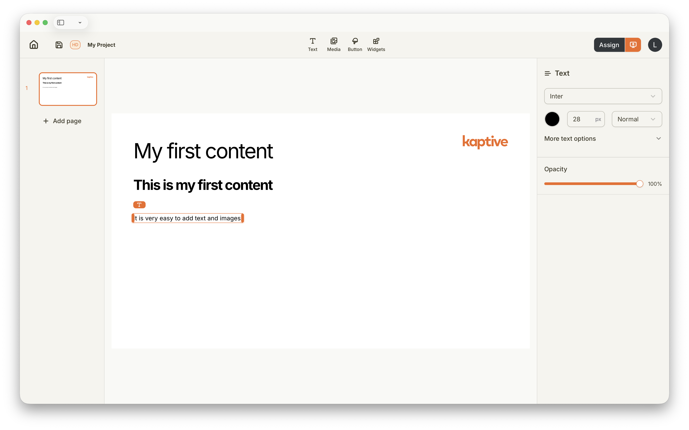

import { Steps } from '@astrojs/starlight/components';
import createProjectImg from '../../../../assets/getting-started/create-project/create-project.png';

## Cos'è un Progetto?

Un Progetto in Kaptive è un contenitore per i tuoi Contenuti di digital signage. Ti permette di creare layout, aggiungere media ed Elementi di Contenuto e organizzare tutto in un unico posto. Un Progetto può avere più Pagine; ogni Pagina occuperà l'intero schermo quando pubblicata. Puoi scegliere di passare da una Pagina all'altra automaticamente dopo una durata prestabilita o manualmente tramite elementi interattivi.

## Crea un Nuovo Progetto

Puoi creare un nuovo Progetto dalla sezione Progetti del Kaptive Manager. Segui questi passaggi per creare un nuovo Progetto:

<Steps>
    1. Nella sezione Progetti, clicca sul pulsante `Start new Project`.
    2. Inserisci un nome e una risoluzione per il tuo Progetto.

       

       La risoluzione deve corrispondere alla risoluzione dello schermo su cui verrà visualizzato il Contenuto.
    3. Clicca su `Create` per finalizzare la creazione del tuo Progetto.
</Steps>

## Usa il Kaptive Editor

Il Kaptive Editor è un'interfaccia intuitiva drag-and-drop che ti permette di progettare facilmente i tuoi Contenuti di digital signage. Puoi aggiungere diversi Elementi di Contenuto come immagini, video, testo e widget interattivi alle Pagine del tuo Progetto.

Il Kaptive Editor è diviso in 4 sezioni:

    1. La barra degli strumenti in alto fornisce accesso alle impostazioni del Progetto, ai controlli di pubblicazione e agli strumenti per aggiungere Elementi di Contenuto.
    2. La barra laterale sinistra contiene l'elenco delle Pagine del tuo Progetto e ti permette di navigare tra di esse.
    3. La barra laterale destra mostra le proprietà e le impostazioni dell'Elemento di Contenuto selezionato, permettendoti di personalizzare il suo aspetto e comportamento.
    4. L'area centrale del canvas è dove progetti le Pagine del tuo Progetto aggiungendo e disponendo gli Elementi di Contenuto.

## Crea il tuo Primo Contenuto

Per iniziare, prova ad aggiungere alcuni Elementi di Contenuto alla Pagina del tuo Progetto. Puoi trascinare immagini, video e testo dalla barra degli strumenti sul canvas. Sperimenta con diversi layout e stili per trovare quello che funziona meglio per le tue esigenze di digital signage.

