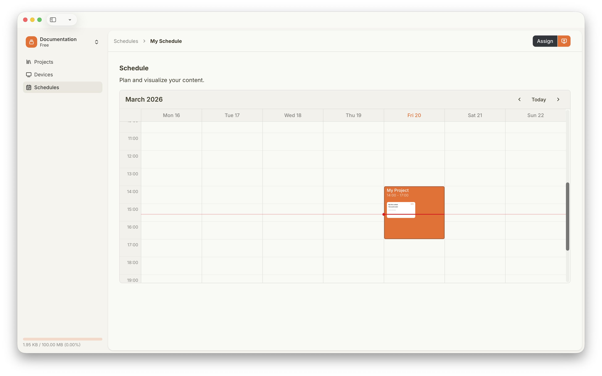
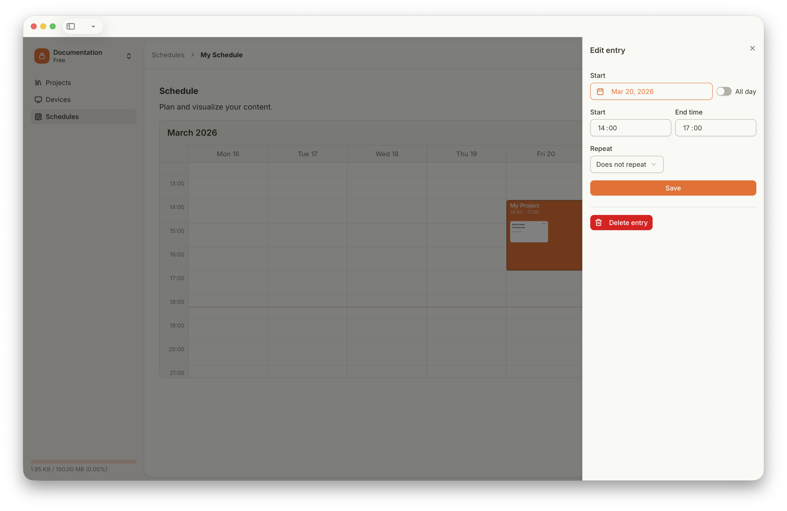
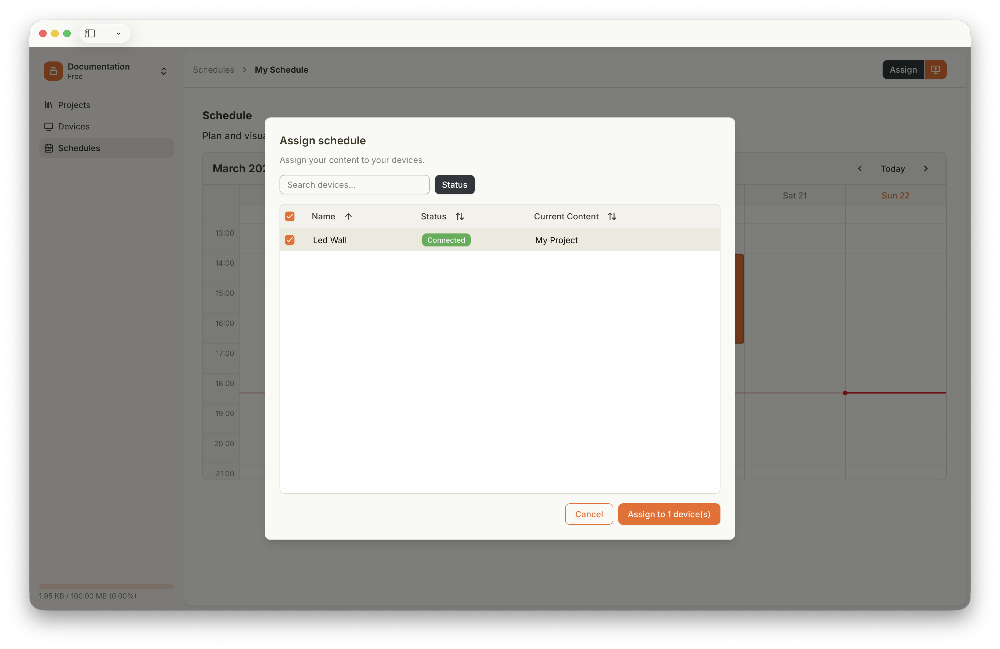

## Come Funziona la Pianificazione sui Kaptive Player

Probabilmente hai già letto il capitolo sull'assegnazione dei Progetti. La pianificazione è l'altro modo per mostrare Contenuti sui tuoi Kaptive Player. Invece di assegnare un singolo Progetto a un Player, puoi pianificare diversi Progetti in una Pianificazione. Una Pianificazione è una raccolta di Progetti che vengono mostrati su un Player in orari specifici.

Quando crei una Pianificazione, puoi selezionare quali Progetti vuoi includere nella Pianificazione e quando devono essere mostrati sui Player assegnati.

Cliccando su un Progetto nella Pianificazione, puoi selezionare l'intervallo di tempo in cui il Progetto deve essere mostrato e configurare il suo intervallo di ripetizione. La ripetizione può essere impostata solo quando nessun altro Progetto pianificato si sovrappone nel futuro.

Puoi aggiungere quanti Progetti vuoi a una Pianificazione, ma non possono sovrapporsi nel tempo.

## Assegna una Pianificazione a un Player

Dopo aver creato una Pianificazione, puoi assegnarla a un Player cliccando il pulsante `Assign` nell'editor della Pianificazione. Quando una Pianificazione è assegnata a un Player, il Player mostra i Progetti nella Pianificazione secondo gli intervalli di tempo e le impostazioni di ripetizione definiti.

Quando una Pianificazione è assegnata a un Player ma nessun Progetto è pianificato per essere mostrato nell'orario corrente, il Player mostra il Progetto predefinito assegnato. Questo ti permette di avere un Contenuto di riserva quando nessun Progetto pianificato è attivo. Il Contenuto predefinito viene configurato assegnando un Progetto al Player.

## Pubblica gli Aggiornamenti della tua Pianificazione

Quando apporti modifiche a una Pianificazione, devi pubblicare le modifiche affinché abbiano effetto sui Player assegnati. Per pubblicare le modifiche, clicca semplicemente il pulsante arancione `Publish` nell'editor della Pianificazione. Questo aggiorna la Pianificazione su tutti i Player che attualmente hanno questa Pianificazione assegnata.
